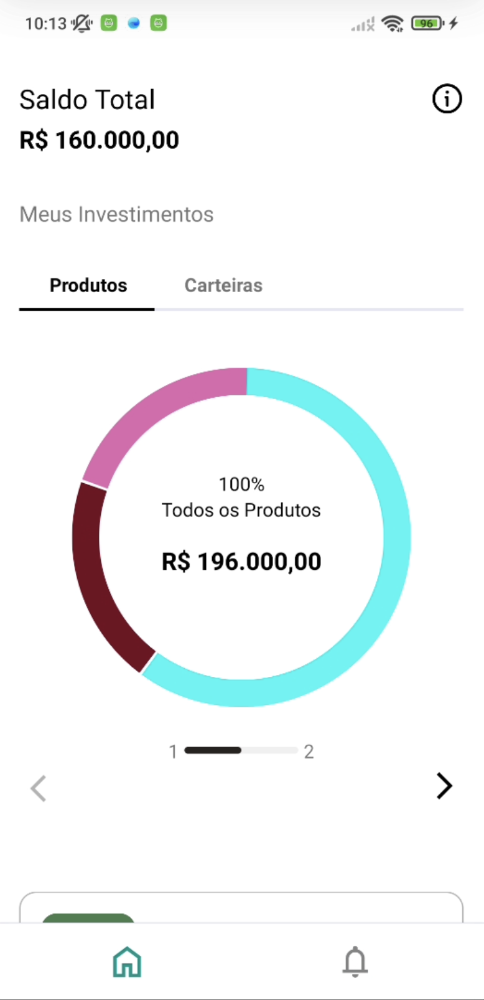
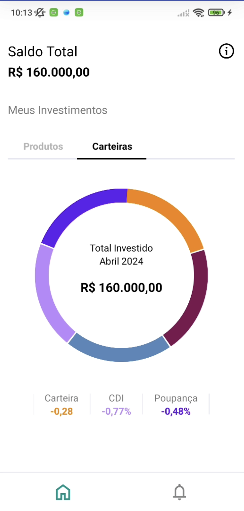
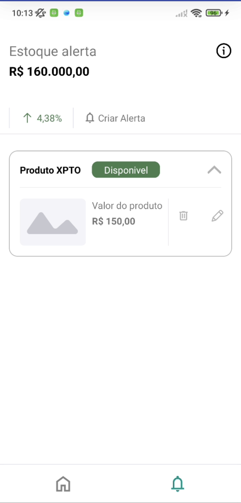

# README -  Projeto de Desafio Android

Desafio Android para o cargo de Especialista. Aqui você encontrará informações sobre o repositório, a aplicação e a estratégia de implementação adotada.

## Repositório

Este repositório contém o código-fonte de um aplicativo de investimentos desenvolvido como parte do desafio para o cargo de Especialista Android.

### Estrutura do Repositório

- `app`: Módulo principal do aplicativo.
- `home`: Módulo que contém a feature home.
- `stock_alert`: Módulo que contém a feature stock alert.
- `network`: Módulo responsável pela comunicação com o backend.

## Aplicação

O aplicativo de investimentos tem como objetivo fornecer aos usuários informações sobre seus investimentos e alertas de preço para ativos específicos.

### Funcionalidades Principais

- **Home:**
    - Exibe saldo em carteira.
    - Mostra gráficos de desempenho.
    - Apresenta distribuição do tipo de produtos na carteira.
    - Lista movimentações recentes.
    - Exibe saldo em conta para investimento.

- **Stock Alert:**
    - Permite adicionar, editar e remover itens de alerta.
    - Os alertas são disparados quando o preço do ativo/produto atinge um valor especificado.

### Estratégia de Implementação

A estratégia de implementação adotada segue os princípios de modularidade, desacoplamento e teste unitário.

- **Modularidade:** As features foram desenvolvidas como bibliotecas independentes para garantir a separação de preocupações e facilitar a manutenção do código.

- **Desacoplamento:** Cada módulo é responsável por sua própria lógica de negócio, minimizando dependências entre eles.

- **Teste Unitário:** Foram escritos testes unitários para garantir a qualidade e robustez do código. A estratégia de cobertura foi focada nas áreas críticas da aplicação.

## Configuração do Backend Local

Para rodar o aplicativo localmente, é necessário configurar um backend local. Siga os passos abaixo para configurar e executar o backend:

### Pré-requisitos

- Java JDK instalado na sua máquina.
- Kotlin instalado na sua máquina.
- Gradle instalado na sua máquina.

### Passo a Passo

1. Clone o repositório do backend:

```bash
git clone https://github.com/leocluque/backend-app-invest.git
```

2. Navegue até o diretório do backend:

```bash
cd nome-do-backend
```

3. Execute o backend:

```bash
./gradlew run
```

4. O servidor backend estará rodando localmente na porta padrão. Anote o IP do servidor para configurar no módulo `network` do aplicativo.

## Rodando o Projeto Localmente

Para rodar o projeto localmente, siga os passos abaixo:

### Pré-requisitos

- Android Studio instalado na sua máquina.
- Dispositivo Android conectado ou emulador configurado.

### Passo a Passo

1. Clone este repositório para a sua máquina local:

```bash
git clone https://github.com/leocluque/app-invest.git
```

2. Abra o Android Studio.

3. No Android Studio, abra o diretório do projeto clonado.

4. Aguarde o Android Studio carregar e sincronizar o projeto.

5. Abra o módulo `network` do projeto.

6. No arquivo de configuração(NetworkConstants) tem a variavel de IP do servidor (BASE_URL), insira o IP do servidor backend local que você anotou anteriormente.

7. Conecte um dispositivo Android ou inicie um emulador.

8. Execute o aplicativo no dispositivo/emulador selecionado.

9. Explore as funcionalidades do aplicativo diretamente no dispositivo/emulador.

### Previas








## Conclusão

Este README fornece uma visão geral do projeto de desafio Android, incluindo informações sobre o repositório, a aplicação, a estratégia de implementação e a configuração do backend local. 🚀